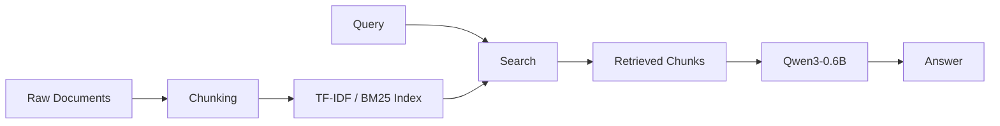

# 42 RAG

Personal implementation of the 42 RAG project — a Retrieval-Augmented Generation pipeline for code and documentation.

## Overview

Build a searchable knowledge base from the [vLLM](https://github.com/vllm-project/vllm) repository, retrieve relevant snippets for a query, and answer questions using a local LLM.

## Features

- **Ingest** — Parse, chunk, and index Python code and Markdown documentation using TF-IDF / BM25
- **Search** — Semantic search over the indexed knowledge base with top-k retrieval
- **Answer** — Generate natural language answers using [Qwen3-0.6B](https://huggingface.co/Qwen/Qwen3-0.6B) with retrieved context
- **Evaluate** — Measure retrieval quality with recall@k metrics against ground truth annotations
- **CLI** — All operations driven via command-line interface

## CLI Commands

| Command | Description |
|---|---|
| `./program index <path>` | Index a repository |
| `./program search <query>` | Search with a single query |
| `./program search_dataset <file>` | Batch process multiple queries from a JSON dataset |
| `./program answer <query>` | Answer a single question without context |
| `./program answer_dataset <file>` | Generate answers from search results |
| `./program evaluate <file>` | Evaluate search results against ground truth |

## Installation

```sh
uv sync
```

Requires Python ≥ 3.14.

## Usage

```sh
# Index the vLLM repository
./program index path/to/vllm

# Search for a snippet
./program search "How does the scheduler work?"

# Answer a question
./program answer "What is PagedAttention?"
```

## Architecture



### Performance Targets

| Domain | Recall@5 |
|---|---|
| Documentation | ≥ 80% |
| Code | ≥ 50% |

## Project Status

Early development. See [specifications](project_management/specifications.md) for the full project scope.
